# nTorrent

A fast, native BitTorrent client with a UI inspired by Google Photos — fluid grids, shared-element
transitions, and a clean Material-style design. Built on [Tauri 2](https://tauri.app/),
[librqbit](https://github.com/ikatson/rqbit) (a pure-Rust torrent engine), React 19, and
Tailwind CSS v4.

## Features

- **Full torrent lifecycle** — magnet links and `.torrent` files, start/pause/resume/remove,
  optional file-by-file selection before a download begins or at any point afterward.
- **Detail drawer** — click any torrent for a bottom-drawer view with live speed/peer stats, a
  per-file download picker, a trackers tab (with favicons), and a peers tab with reverse-DNS
  hostname resolution.
- **Create torrents** — pick a file or folder, add trackers, choose a piece size, and save the
  resulting `.torrent`.
- **VPN-aware port mapping** — tries NAT-PMP/PCP first (works with VPN gateways such as
  ProtonVPN's), then UPnP for home routers, then an optional provider adapter (PIA). The Network
  screen shows the live mapped port, external IP, and mapping history.
- **Bind-to-interface** — force all torrent traffic through a specific network adapter (e.g. your
  VPN's tunnel interface), with adapters auto-detected and VPN adapters called out separately.
- **Proxy & IP filtering** — an optional SOCKS5 proxy for peer/tracker traffic, and an optional
  IP blocklist/allowlist.
- **Statistics** — live speeds and peer breakdown, this-session totals, and all-time
  upload/download + share ratio that survives restarts.
- **An Advanced settings tab** — process priority, refresh interval, DHT bootstrap nodes, an
  embedded BEP3 tracker, Mark-of-the-Web tagging for downloaded files, and more.
- **RSS auto-download** — poll feeds and auto-add items matching your own rules.
- **Pluggable search** — no bundled indexers; add your own search-provider URL templates.
- **Bandwidth scheduling** — time-of-day upload/download limit rules.
- **A watched folder**, native `.torrent`/`magnet:` file associations, and per-torrent queueing
  (cap how many torrents download at once).
- **Optional remote Web UI** — the same functionality as the desktop app, exposed over
  HTTP/WebSocket with bearer-token auth, toggle on/off from Settings.
- **Labels**, light/dark theme with animated backgrounds, 4 languages, and a first-run setup
  wizard.

## Planned features

- **Anonymous mode** — strip client-identifying info from peer/tracker handshakes and disable
  features that could deanonymize the user when running over a VPN/proxy.

## Screenshots

| Library | Torrent details |
| --- | --- |
| 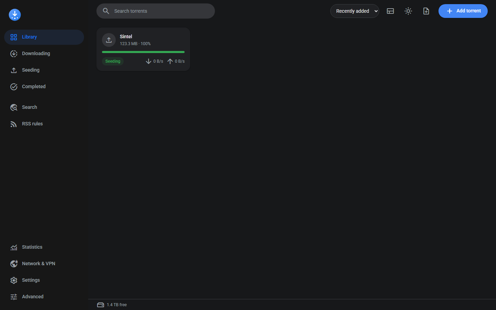 | 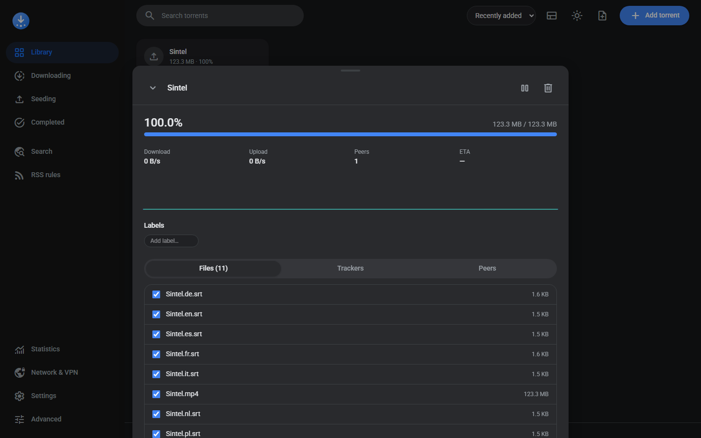 |

| Trackers | Peers |
| --- | --- |
| 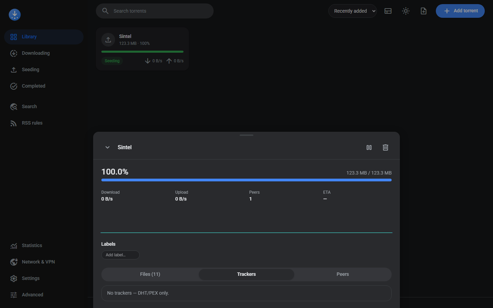 | 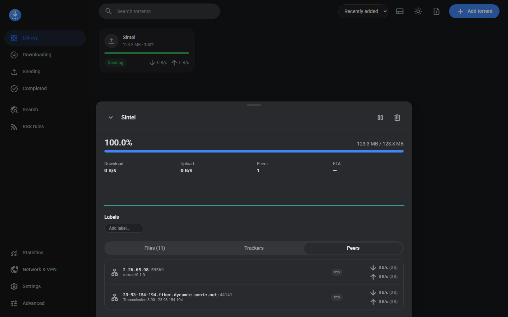 |

| Add a torrent | Review files before downloading |
| --- | --- |
| 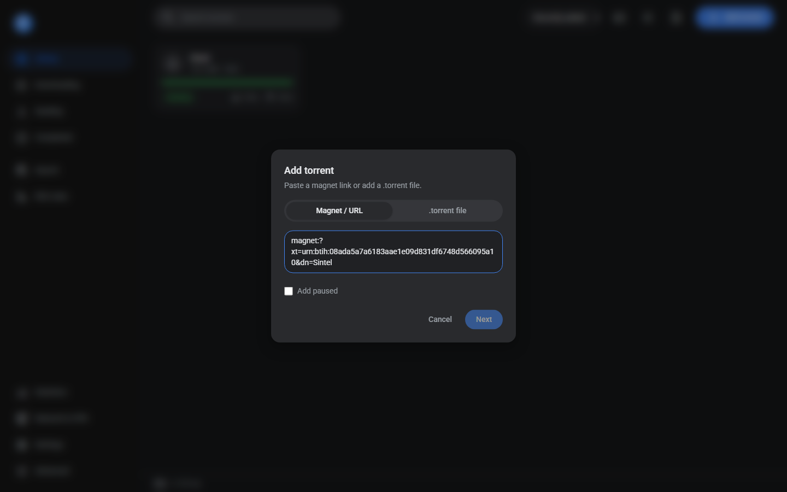 | 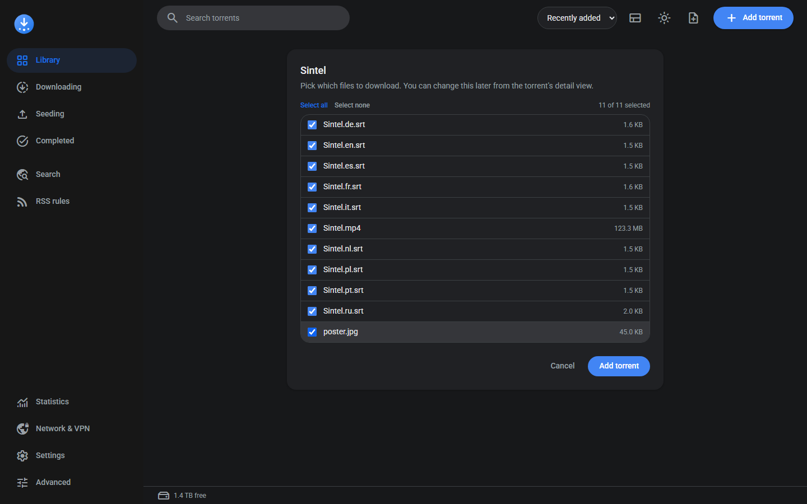 |

| Create a torrent | Statistics |
| --- | --- |
| 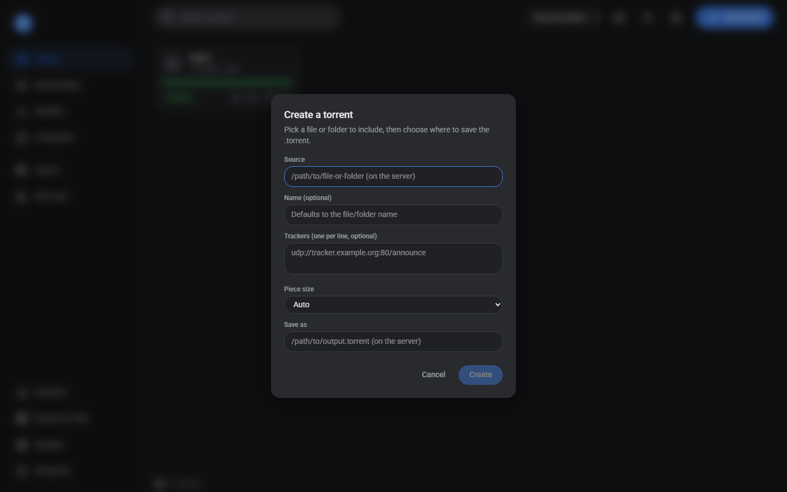 | 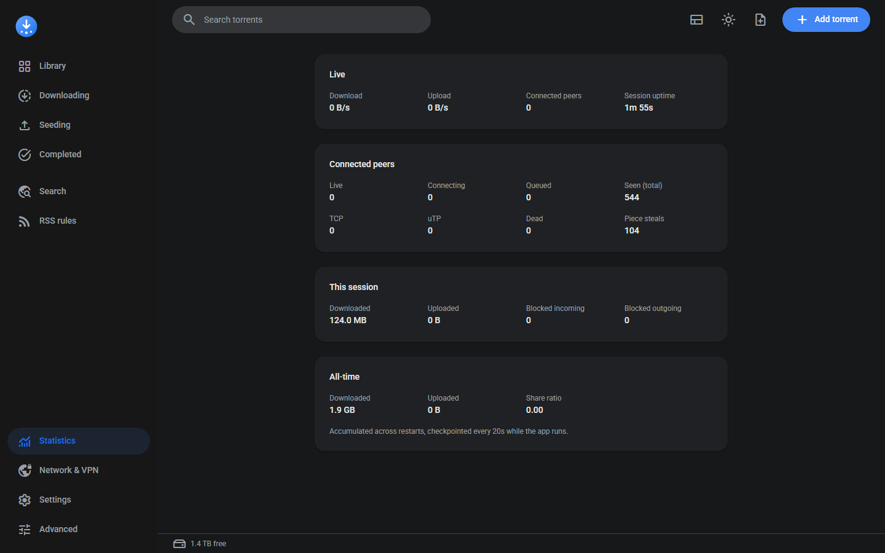 |

| Network & VPN | Settings |
| --- | --- |
| 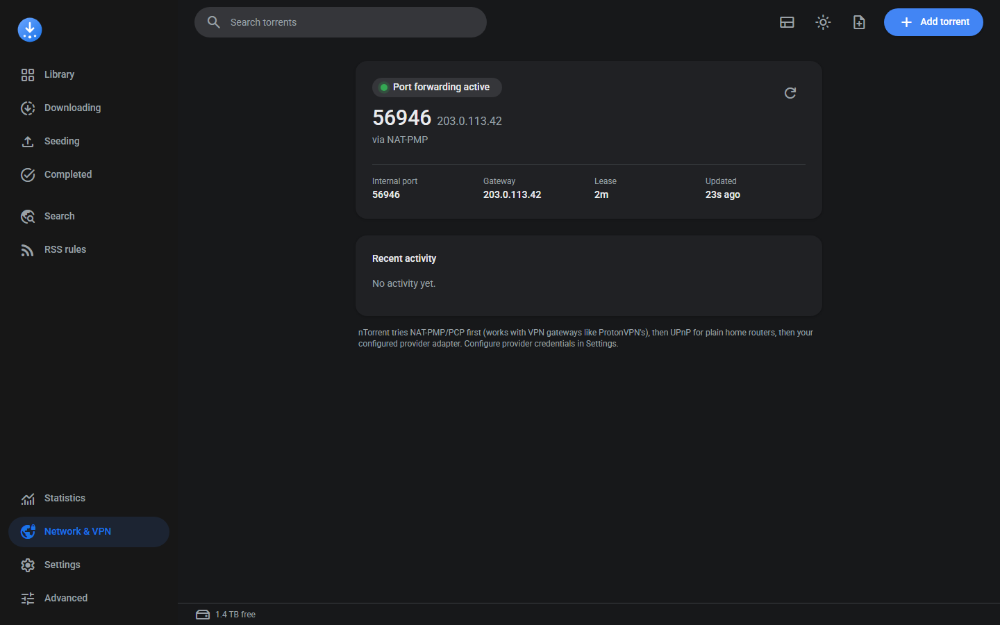 | 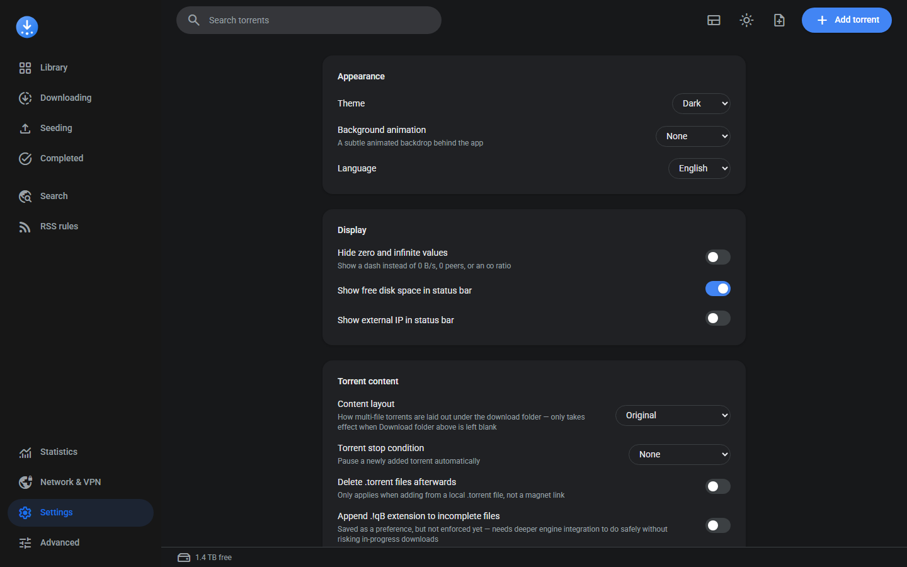 |

| Advanced |
| --- |
| 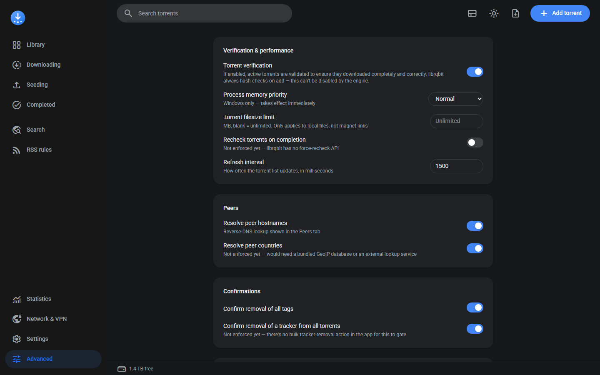 |

## Prerequisites

nTorrent is a Tauri 2 app: a Rust backend embedding the librqbit torrent engine, with a
React/TypeScript frontend. You'll need both toolchains installed.

- **Node.js** 20+ and npm
- **Rust** (stable toolchain) — install via [rustup](https://rustup.rs/)
- Platform-specific Tauri build dependencies — follow the official
  [Tauri prerequisites guide](https://tauri.app/start/prerequisites/) for your OS:
  - **Windows** — Microsoft C++ Build Tools (or Visual Studio with the "Desktop development
    with C++" workload) and the WebView2 runtime (preinstalled on modern Windows 10/11).
  - **macOS** — Xcode Command Line Tools (`xcode-select --install`).
  - **Linux** — `webkit2gtk`, `libappindicator`, `librsvg`, and the standard build-essential
    packages for your distro (see the Tauri guide for the exact package list per distro).

## Getting the code

```sh
git clone <this-repo-url>
cd nTorrent
npm install
```

## Running in development

This starts the Vite dev server and launches the Tauri window with hot reload for the frontend
and automatic rebuilds when Rust source changes:

```sh
npm run tauri dev
```

## Building / compiling for production

Produces an installer/bundle for your current platform (`.msi`/`.exe` on Windows, `.dmg`/`.app`
on macOS, `.deb`/`.AppImage` on Linux) plus a standalone release binary:

```sh
npm run tauri build
```

Build artifacts land in `src-tauri/target/release/` (binary) and
`src-tauri/target/release/bundle/` (installers).

### Frontend / backend only

If you just want to typecheck or build the frontend on its own:

```sh
npm run build       # tsc + vite build -> dist/
npx tsc --noEmit    # typecheck only
```

Or check the Rust backend on its own:

```sh
cd src-tauri
cargo check
cargo build --release
```

## Using the remote Web UI

nTorrent can expose the same functionality over HTTP for remote management. It's off by default:

1. Open **Settings → Web UI** in the desktop app.
2. Toggle it on — a bearer token is generated automatically the first time you enable it.
3. Optionally allow LAN access (binds `0.0.0.0` instead of `127.0.0.1`) once a token is set.
4. Visit `http://<host>:<port>/` (default port `3030`) and enter the token to log in.

## Project structure

```
src/                 React frontend
  app/                 screens: Library, Network/VPN, Settings, Search, RSS rules
  components/          TorrentCard, DetailOverlay, Sidebar, TopBar, AddTorrentDialog,
                        ReviewFilesScreen, TitleBar, OnboardingScreen, ...
  stores/              zustand stores (torrents, settings, ui, vpn)
  lib/                 tauri-bridge (typed invoke/HTTP dual transport), formatters
src-tauri/            Rust backend
  src/
    commands/            Tauri commands: torrents, vpn, settings, rss, search
    engine/              wraps librqbit::Session, stats broadcasting
    portmap/              NAT-PMP/PCP, UPnP, and PIA port-mapping adapters
    web_ui/              embedded axum HTTP/WebSocket server mirroring the Tauri commands
```

## Tech stack

Tauri 2 · Rust · [librqbit](https://github.com/ikatson/rqbit) · React 19 · TypeScript ·
Tailwind CSS v4 · Radix UI · Motion (Framer Motion) · Zustand · axum
